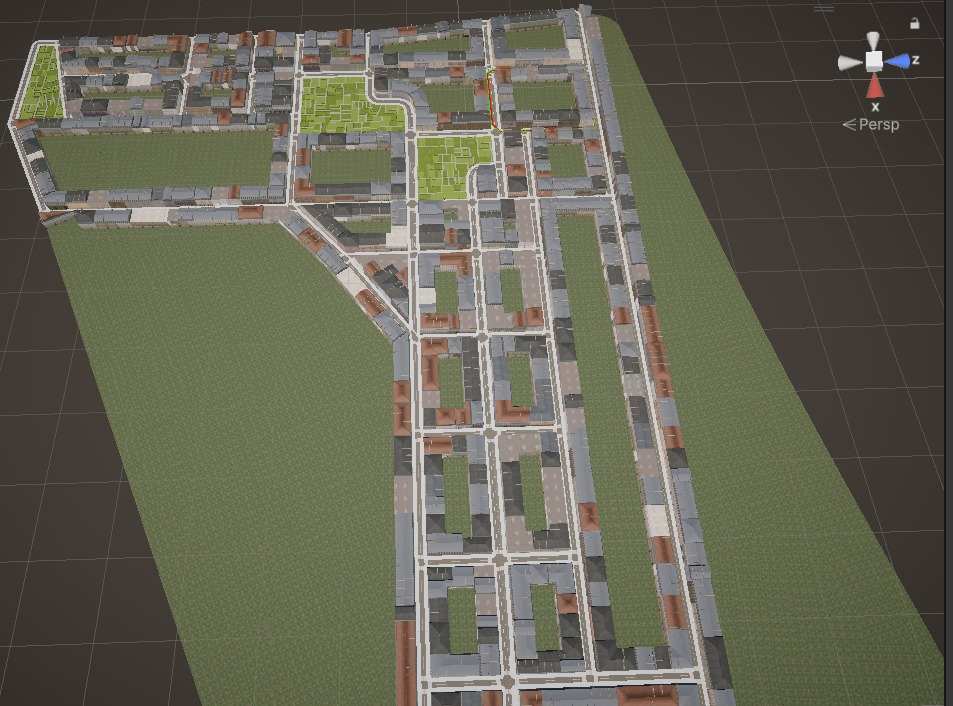

# 🏙 Simulation Piétons Urbains  
*Une **modélisation** **3D** réaliste des flux piétons dans une **ville virtuelle.**  

  

## 🌟 Fonctionnalités  
- **IA de navigation** : Déplacements naturels avec évitement d'obstacles (**NavMesh Unity**).  
- **Variété comportementale** : **Piétons pressés**, flâneurs, touristes.  
- **Environnement riche** : **Bâtiments**, **rues**, passages piétons modélisés sous Blender.  
- **Paramétrage en temps réel** : **Densité**, **vitesse**, **points d'intérêt**.  

## 🛠 Technologies  
- **Moteur 3D** : **Unity 2022**  
- **Modélisation** : **Blender 3.5**  
- **Textures/Design** : **GIMP 2.10** **(création et édition des textures)**  
- **Scripts** : **C#** (**NavMesh**, **Machines à états finis**)  

## 🚀 Guide d'Installation  
1. Téléchargez [Unity 2022](https://unity.com/fr/download).  
2. Clonez ce dépôt :  
   ```bash
   git clone https://github.com/Takouchouang/Simulation-Piétons-Urbains.git
   ```  
3. Ouvrez le projet dans Unity et lancez la scène principale.  

## 📊 Résultats  
- **Performances** : **30 FPS** avec 300 piétons (PC standard).  
- **Détails** : Consultez le [rapport final](Docs/Rapport_Projet.pdf).  

## 📜 Licence  
Ce projet est sous licence MIT - voir le fichier [LICENSE](LICENSE).  
